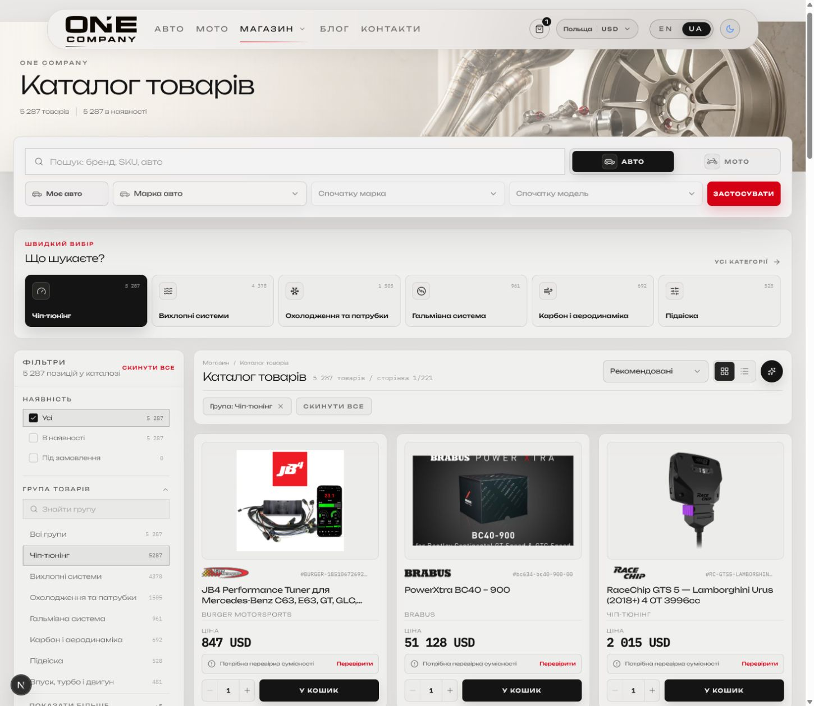
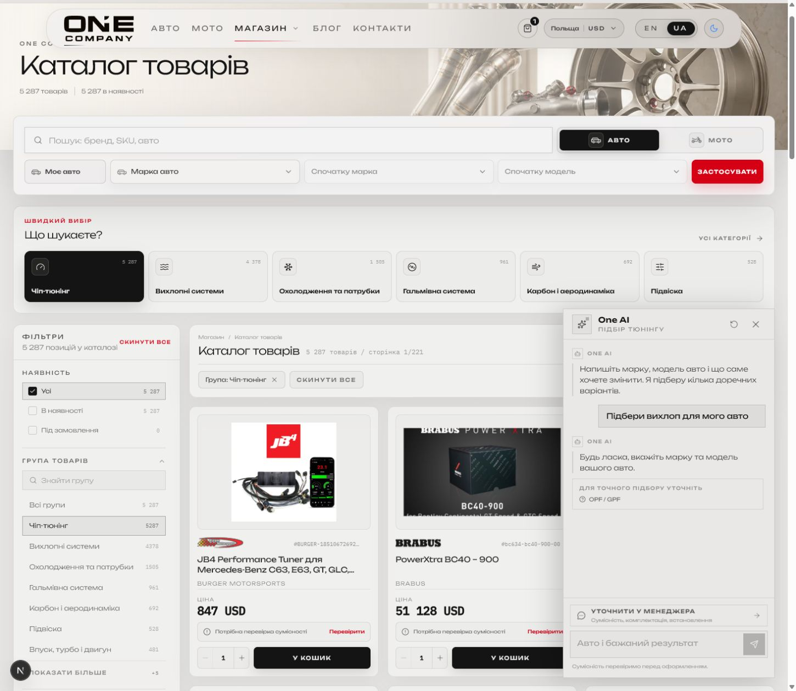
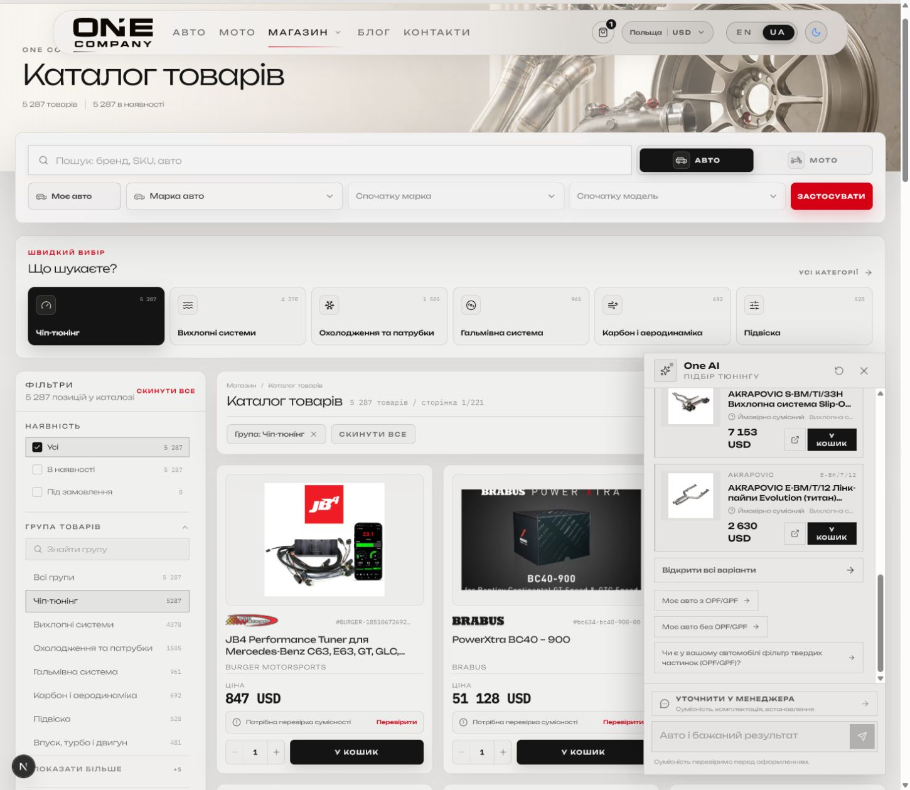
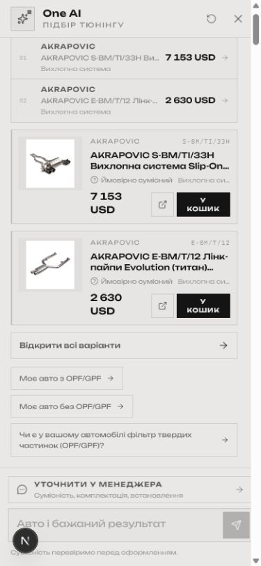
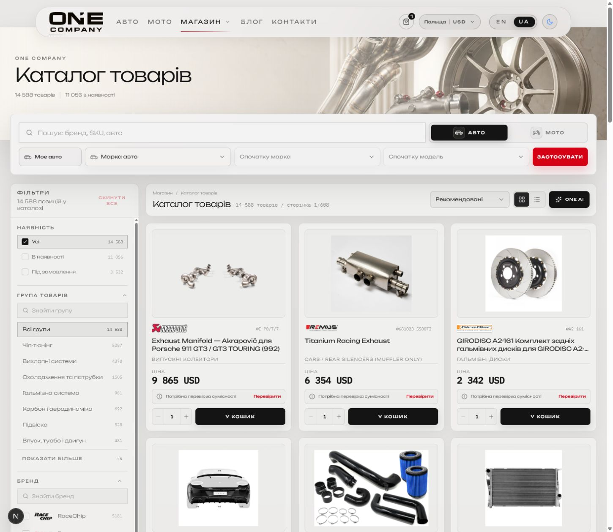
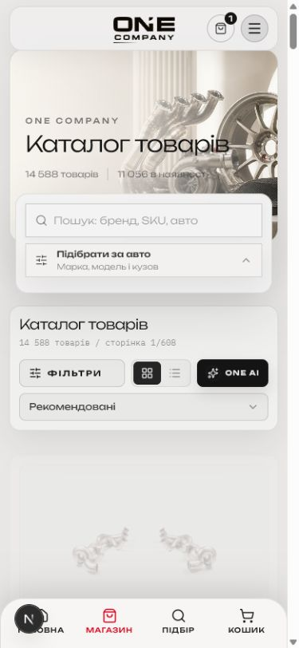

# One AI — UX and accessibility audit

## Audit scope

Surface: One AI inside the One Company product catalog.

User goal: describe a vehicle and desired upgrade, receive grounded product recommendations, compare options, open a product, add it to the cart, or hand the request to a manager.

## Flow

### Step 1 — Find One AI in the catalog

Health before the update: **Needs improvement**

- The launcher was a small unlabeled sparkle icon beside the grid/list switch.
- It looked like another display control rather than a tuning assistant.
- The quick-category block duplicated the deterministic category filters and pushed products farther down.
- The launcher had a useful accessible name, but the visual affordance did not communicate the same meaning to sighted users.

### Step 2 — Open the assistant

Health: **Good**

- The panel clearly identifies itself as a tuning assistant.
- Starter prompts reduce blank-input friction.
- The manager handoff remains visible without competing with the primary input.
- Dialog semantics, labelled controls, Escape handling, focus return, focus trapping, and reduced-motion support are present in the implementation.

### Step 3 — Clarify an incomplete request

Health before the update: **Needs improvement**

- One AI correctly asked for make and model.
- It also surfaced OPF/GPF at the same time, before the vehicle was known. This made the clarification look contradictory and more technical than necessary.
- The update now asks only for the missing vehicle first. OPF/GPF appears later, when it is relevant to an actual exhaust selection.

### Step 4 — Receive and act on recommendations

Health: **Good, with density risk**

- Recommendations are grounded in real catalog products, SKUs, routes, and current currency.
- The response preserves uncertainty with “Ймовірно сумісний” and a manager handoff.
- Users can compare, open a product, add it to the cart, continue the conversation, or apply the generated filters to the catalog.
- The comparison list and full product cards repeat some information. On a narrow panel this makes longer answers dense.

### Step 5 — Use One AI on mobile

Health: **Usable, but dense**

- The full-screen dialog is appropriate for mobile and keeps the input reachable.
- Product cards and actions remain functional.
- Long product names are heavily truncated and the comparison-plus-cards layout consumes substantial vertical space.
- Screenshot evidence cannot confirm screen-reader announcements, soft-keyboard behavior, or every focus transition.

### Step 6 — Catalog after cleanup

Health after the update: **Good**

- The duplicate quick-category block is gone.
- Filters remain the fast, deterministic, no-AI path for category browsing.
- One AI is now a labelled action, so its purpose is clear without opening it.
- When a category is already active, the greeting and first suggested action now use that category instead of offering an unrelated generic exhaust request.
- Products begin higher on both desktop and mobile.

## Technical and cost assessment

- One AI is not a decorative chat widget: it parses the request, searches the real catalog, applies deterministic compatibility constraints, optionally reranks candidates semantically, returns real product cards, and supports manager handoff.
- A completed recommendation can use two Gemini `generateContent` calls: planning and grounded response generation.
- If semantic reranking is enabled, the same request can also use one embedding call.
- The endpoint is limited to 20 requests per five minutes per IP and falls back to deterministic planning or lexical ranking when AI services are unavailable.
- One AI should therefore complement filters, not replace them. Filters remain faster and cheaper for users who already know the category.

## Highest-impact next improvements

1. Avoid the AI planning call when the deterministic parser already has a clear category and vehicle.
2. On mobile, show either the compact comparison or the full cards first instead of both at once.
3. Add lightweight usage telemetry for launcher opens, completed recommendations, product clicks, filter application, manager handoff, latency, degraded responses, and estimated provider calls.

## Evidence limits

This audit verified the visible catalog entry point, dialog, clarification, real recommendation response, product actions, and responsive layout. It did not claim full WCAG compliance, validate every screen reader, test production latency, or measure provider billing.
