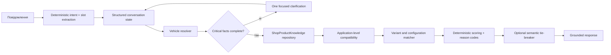
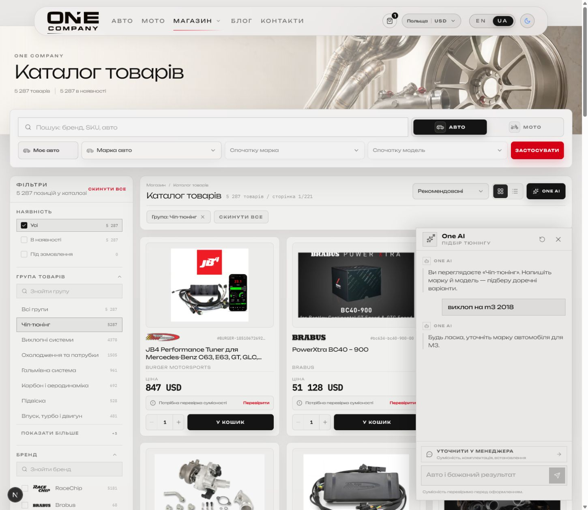
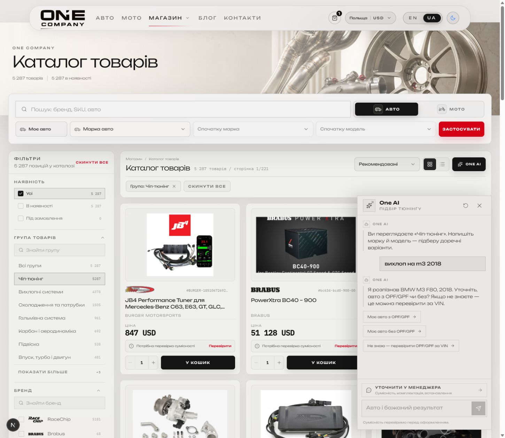

# One AI — аудит і цільова архітектура підбору

Дата: 17.07.2026  
Сценарій: `вихлоп на m3 2018`

## Висновок

До виправлення One AI був небезпечним саме як підбір товарів: мовна модель могла втратити марку, пошук починався до уточнення OPF/GPF, кузов `2018 → F80` не повертався у план, а відсутні роки у картці товару прирівнювалися до несумісності.

Після P0-виправлення цей сценарій працює так:

1. `M3` детерміновано розпізнається як `BMW M3`.
2. Локальна fitment-база резолвить `BMW M3, 2018` у `F80`.
3. One AI не запускає рекомендації, доки невідомий критичний параметр OPF/GPF.
4. Користувач отримує три чесні варіанти: `з OPF/GPF`, `без OPF/GPF`, `не знаю — перевірити за VIN`.
5. Товар іншої моделі, кузова або року більше не може пройти лише через загальний текстовий збіг.

## Перевірений шлях

### 1. Розуміння запиту — Healthy

Було: One AI просив назвати марку для `M3`.

Стало: `M3 2018 → BMW M3 F80, 2018`.

### 2. Резолв автомобіля — Healthy

Використовується локальна fitment-база, а не припущення Gemini. Результат містить статус, confidence, source і список кандидатів. Якщо поколінь декілька, бот не вгадує кузов, а просить рік або chassis.

### 3. Gate критичних параметрів — Healthy

`requiredDetails` тепер блокує пошук. Для вихлопу OPF/GPF більше не є декоративною підказкою після неправильної відповіді.

### 4. Перевірка сумісності товару — Healthy with review state

Make, model, chassis і year перевіряються в межах однієї application. Результат має три стани:

- `match` — наявні узгоджені докази;
- `unknown` — суперечності немає, але частини даних бракує;
- `contradiction` — товар відхиляється.

Відсутній year range більше не означає автоматичне `incompatible`, але такий товар позначається як такий, що потребує перевірки.

### 5. Тип товару — Healthy

Насадки, downpipe і link-pipe визначаються за назвою та категорією раніше за загальне слово `system`. Опис товару більше не може перетворити насадки або дзеркала на повну вихлопну систему.

### 6. Retrieval — Needs next phase

One AI досі використовує внутрішній HTTP-виклик storefront search. Для цільової версії потрібен окремий repository поверх `ShopProductKnowledge`, без fallback-розширення storefront і без повторного HTTP-проходу.

### 7. Conversation state — Needs next phase

Поточний conversation зберігає previous plan і показані SKU. Цільова версія повинна зберігати підтверджені slots, pending question, відхилені варіанти й джерело кожного fitment-факту.

## Цільова архітектура

Принцип: LLM може розуміти формулювання і красиво скласти коротку відповідь, але не визначає кузов, OPF, сумісність, SKU, ціну або конфігурацію.

## До / після

### До

### Після

## Реалізовано в P0

- детермінований fast path для відомих shopping-intent запитів;
- catalog-backed vehicle resolver;
- блокуючі `requiredDetails`;
- OPF/GPF/VIN quick replies;
- повний внутрішній candidate set замість перших 48;
- correlated fitment validation;
- `match / unknown / contradiction`;
- title/category-first product-kind classifier;
- бренд Akrapovič/Remus/iPE більше не визначає категорію `exhaust` сам по собі;
- unit regression для `M3 2018 → F80`, неоднозначних поколінь, wrong-model, unknown year, tailpipe/downpipe/mirror cases.

## Наступний архітектурний етап

1. Винести retrieval у `ShopAiKnowledgeRepository` з прямим запитом до `ShopProductKnowledge`.
2. Перенести make/model/chassis/year/engine/market/OPF/drivetrain у одну application-сутність.
3. Рекомендувати точний variant/SKU, а не абстрактну product card.
4. Додати conversation state v2 зі slot provenance і pending question.
5. Додати route-level golden test: initial query → OPF clarification → exact result/no-match/VIN handoff.
6. Залишити Gemini тільки для справді неоднозначної мови й необов’язкового формулювання відповіді.

## Перевірки

- TypeScript: pass.
- ESLint для змінених AI-файлів: pass.
- 60 сфокусованих AI/search/taxonomy тестів: pass.
- Live API сценарій: pass.
- Live browser сценарій у відкритому localhost: pass.
- Повний legacy unit suite має окремі наявні збої в admin/Urban/assets і тести, що потребують `DATABASE_URL`; AI-регресій у сфокусованому наборі немає.
