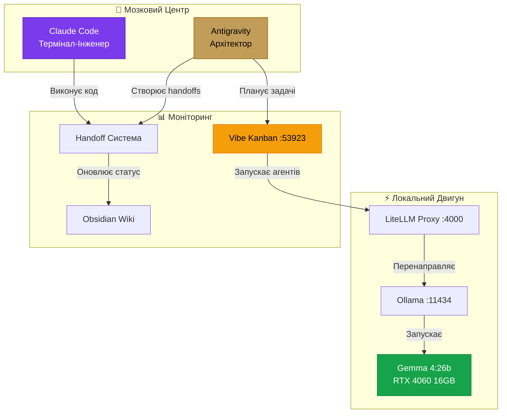

# 🤖 AI Agent Syndicate

> [!info] Автономна система ШІ-розробки One Company
> Повністю локальна, безкоштовна, приватна мульти-агентна архітектура.
> Оновлено: **07 квітня 2026**

---

## 🏛️ Архітектура Синдикату



---

## 👥 Агенти

| Агент | Роль | Спеціалізація |
|---|---|---|
| **🧠 Antigravity** | Архітектор | Планування, дизайн, візуальна генерація, MCP-інтеграції |
| **⚙️ Claude Code** | Інженер | Термінальні операції, кодинг, файлові операції |
| **🦙 Gemma 4:26b** | Двигун | Локальна LLM через Ollama (RTX 4060, 17GB VRAM) |
| **📋 Vibe Kanban** | Дашборд | Візуальне відстеження задач, Project Management |

---

## 📁 Структура Файлів

```
d:\OneCompany\
├── .agents/
│   ├── handoffs/           # 📄 Файли передачі задач між агентами
│   │   ├── README.md       # Документація протоколу
│   │   └── *.md            # Індивідуальні handoff-тікети
│   ├── workflows/
│   │   └── multi-agent.md  # 🔄 Workflow мульти-агентної оркестрації
│   ├── scripts/
│   │   ├── litellm_config.yaml   # ⚡ Конфігурація LiteLLM проксі
│   │   └── Start-LocalClaude.ps1 # 🚀 Скрипт запуску локального Claude
│   └── mcp-servers/
│       └── ollama-bridge/  # 🌉 MCP-сервер для Ollama
└── wiki/
    └── AI Agent Syndicate.md  # 📖 Ця сторінка
```

---

## 🚀 Як запустити

### 1. Ollama (LLM Engine)
```powershell
ollama serve
# Перевірка: ollama list → має бути gemma4:26b
```

### 2. LiteLLM Proxy (Маршрутизатор)
```powershell
$env:PYTHONIOENCODING="utf-8"
$env:PYTHONUTF8="1"
litellm --config d:\OneCompany\.agents\scripts\litellm_config.yaml --port 4000
```

### 3. Vibe Kanban (Візуальний Дашборд)
```powershell
cd d:\OneCompany && npx vibe-kanban
# Відкрити: http://localhost:53923
```

### 4. Claude Code (Виконавець)
```powershell
cd d:\OneCompany && claude
# Або через LiteLLM: використати .agents/scripts/Start-LocalClaude.ps1
```

---

## 🔄 Протокол Handoff

Агенти обмінюються задачами через Markdown-файли в `.agents/handoffs/`:

```yaml
---
id: TASK-001
from: antigravity
to: claude-code
status: PENDING       # PENDING → IN_PROGRESS → REVIEW → DONE
priority: high
created: 2026-04-07
---
```

### Статуси задач:
- 🟡 `PENDING` — Задача створена, чекає виконавця
- 🔵 `IN_PROGRESS` — Агент працює над задачею
- 🟣 `REVIEW` — Задача готова, потрібна перевірка
- 🟢 `DONE` — Задача завершена та верифікована

---

## 🔗 Пов'язані сторінки

- [[Tasks Kanban]] — Kanban дошка задач
- [[Architecture]] — Технічна архітектура платформи
- [[DevOps]] — Інфраструктура та деплой
- [[Team]] — Команда One Company
