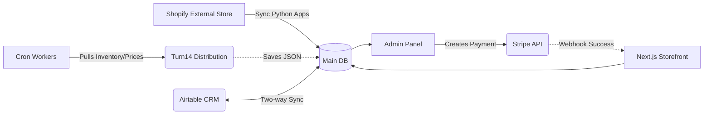

# 🔗 Мапа API та Інтеграцій (API & Integrations)

One Company глибоко інтегрована з низкою зовнішніх В2С і В2В систем, які спілкуються між собою за допомогою Route Handlers у `src/app/api/` та зовнішніх воркерів.

## 1. Внутрішні API Ендпоінти (`src/app/api`)

Маршрутизатор API розбитий на функціональні скоупи (папки):

- **/api/admin**: Ендпоінти, що вимагають аутентифікації адміна та відповідних ролей (перевірка відбувається через NextAuth Session). Використовуються для операцій масового оновлення та вивантажень (експорту з БД).
- **/api/shop**: Відкриті каталогізатори або ендпоінти, спрямовані на клієнта вітрини (швидкий пошук, валідація купонів, отримання інвентарних статусів із Складу).
- **/api/telegram**: Прийом вебхуків від Telegram або статусні ендпоінти для перевірки стану Бота (хоча сам бот може працювати через Long-Polling Node Worker згідно `package.json`).
- **/api/webhooks**: **Критична директорія**. Точка входу для зворотних підтверджень оплат.

## 2. Платіжні системи (Payment Gateways)

Бізнес-логіка розроблена для підтримки глобальних продажів. Checkout є **Гібридним** (див. Основні Правила):
1. Користувач оформлює кошик без прямої оплати на сайті (статус `PENDING_REVIEW`).
2. Менеджер, після перегляду замовлення, формує лінко на оплату через CRM або створює Stripe Checkout Session.
3. Користувач платить за зовнішнім посиланням.
4. Очікується Webhook на стороні бекенду.

### 💳 Stripe
- Використовується для міжнародних платежів (EU/US) для В2С.
- Ендпоінт: `/api/webhooks/stripe`
- Після успішної оплати (`checkout.session.completed`), webhook перевіряє `stripe-signature` і переводить статус замовлення в БД у `CONFIRMED` / Встановлює суму оплати `amountPaid`.

### 💳 WhitePay (Fiat — Apple Pay / Google Pay)
- Використовується для фіатних платежів (GPay, APay) через WhitePay gateway.
- Інтегрований через `WHITEPAY_FIAT` payment method у checkout flow.

## 3. Логістичні Інтеграції (Nova Poshta)

Хоча в основному логістика відслідковується через `ShopShipment` трекінг номери, інтеграція з локальними доставками відбувається на стадії розрахунку (calculate cost) та створенні накладної (ТТН).
- Сутність зберігає номер накладної в полі `ttnNumber`.
- Зовнішний API використовується для отримання актуальних відділень клієнта під час Чекауту.

## 4. Складська Синхронізація (Turn14)

Один із найбільших дистриб'юторів тюнінгу در США. Це гігантська B2B інтеграція.
- Оскільки API Turn14 має обмеження (повільний пошук тощо), One Company тримає локальне повне дзеркало в БД (`Turn14CatalogItem` складає майже мільйон записів!).
- **Оновлення Прайсів:** Python / TS Скрипти періодично викликають Turn14 API (`/items/`, `/inventory/`) і оновлюють `dealerPrice` та `inStock` в нашій БД.
- Логіка зашита в спеціалізованих скриптах (Cron tasks).

## 5. Графік-мапа інтеграцій

