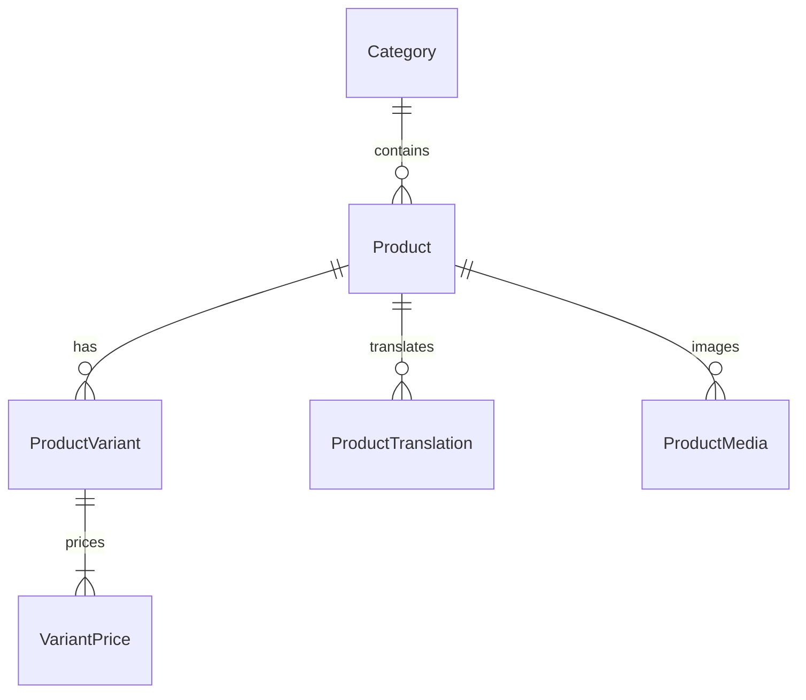
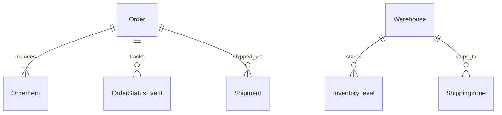
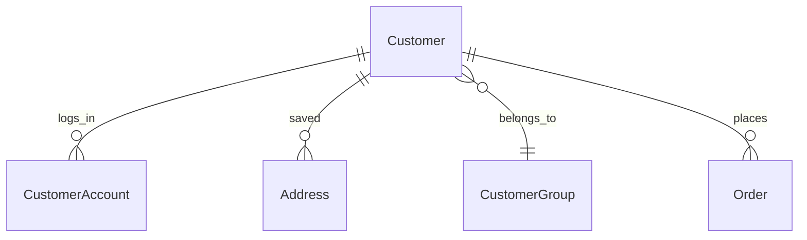

# 🏗 System Architecture

> [!info] Технічна архітектура платформи One Company

---

## 🧩 High-Level Data Flow

```mermaid
graph TD
    Client[Web Client / Браузер]
    NextJS[Next.js App Router (Vercel)]
    DB[(PostgreSQL / Supabase)]
    Turn14[Turn14 API]
    Workers[Cloudflare Workers AI]
    Payment[WhitePay]

    Client <-->|Server Actions / API| NextJS
    NextJS <-->|Prisma ORM| DB
    NextJS <-->|OAuth 2.0 / REST| Turn14
    NextJS -->|Estimation| Workers
    NextJS <-->|Checkout| Payment
```

## 🗄 Prisma Schema Overview (Ecommerce)

Наша база даних розділена на кілька доменів:

### 1. Catalog Domain


### 2. Orders & Logistics Domain


### 3. Customer & B2B Domain


## 🛠 Tech Stack Details

| Шар | Технологія | Призначення |
|---|---|---|
| **Frontend** | React, Next.js 14, TailwindCSS | App Router, Server Components для максимального SEO. |
| **Backend** | Next.js API Routes, Server Actions | Безпечні мутації даних, інтеграція з 3rd party API. |
| **Database** | PostgreSQL (Supabase) | Надійна транзакційна БД. |
| **ORM** | Prisma | Typesafe доступ до бази даних. |
| **State** | Zustand + React Query | Клієнтський стейт (Cart, Checkout flow). |
| **Hosting** | Vercel | Edge CDN, Serverless functions. |

## 🛡 Security (Phase A)

Доступ до адмінки та API захищено через `RBAC` (Role-Based Access Control).

- `AdminUser` має JWT сесію.
- Користувачі мають ролі (`ADMIN`, `MANAGER`, `CONTENT`).
- Вся активність (`CREATE`, `UPDATE`, `DELETE`) записується в `AuditLog`.

← [[Home]]
