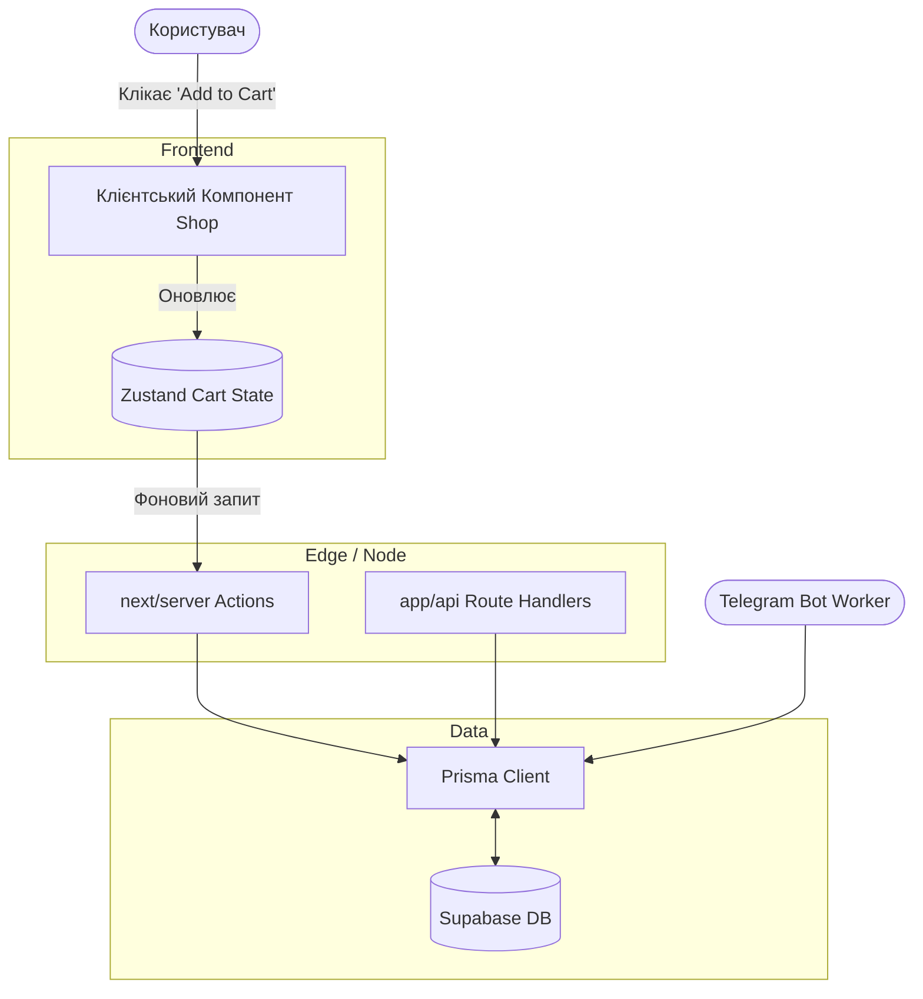

# 🏗️ Архітектура Кодової Бази (Codebase Architecture)

One Company використовує сучасний стек **Next.js 14 App Router**. Це вимагає строгого розподілу на Server Components / Client Components та розумного використання Server Actions. Токен доступу до бази надається через Prisma.

## 1. Структура Директорій

Основний код знаходиться у директорії `src/`:

- **`src/app/`**: Головна точка входу для Next.js App Router.
  - `[locale]/`: Динамічний сегмент для багатомовності (Next-Intl). Всередині знаходиться `shop/`, `admin/`, та інші сторінки. Опрацьовує шляхи типу `/ua/shop` та `/en/shop`.
  - `api/`: Контейнер для всіх серверних Route Handlers (див. [[API & Integrations]]). Повертають JSON відповіді або працюють як webhooks.
- **`src/components/`**: Перевикористовувані UI-компоненти. Часто це клієнтські компоненти (`"use client"`), які місять анімації Framer Motion або 3D рендер.
- **`src/lib/`**: Утилітні функції. Тут живуть конфігурації Prisma Client (`prisma.ts`), логери, хелпери для форматування валют (`formatShopMoney`), та конфігурації Stripe.
- **`src/types/`**: Глобальні TypeScript визначення та Zod схеми для валідації даних з форм та API.
- **`src/i18n/`**: Конфігурація для `next-intl`, логіка резолвінгу мов.

## 2. Server Components vs Client Components

Згідно з жорсткими архітектурними стандартами (виклик `nextjs-architect` skill):

### React Server Components (RSC)
- Використовуються **за замовчуванням**.
- Відповідають за `fetch` даних безпосередньо з БД через Prisma під час рендеру сторінки (наприклад, сторінка списку продуктів).
- Жодного SEO-оверхеда, жодного додаткового JavaScript для клієнта.
- Асинхронні компоненти: `export default async function Page() { ... }`

### Client Components
- Мають директиву `"use client"` на початку файлу.
- Використовуються виключно для:
  - Форм авторизації та чекауту.
  - Інтерактивних частин (Фільтрація продуктів, "Додати в кошик").
  - Three.js 3D-компонентів, Framer Motion анімацій.
- Конвенція: Клієнтські компоненти повинні робитися як можна меншими (Leave them down the tree).

## 3. Server Actions vs Route Handlers

В проекті існують два методи взаємодії клієнта з бекендом.

**Коли використовуються Server Actions?**
Server Actions (наприклад файли `actions.ts`) використовуються для **мутації даних** із форм або клієнтських компонентів.
- Додавання в кошик.
- Видалення товару.
- Оновлення статусу замовлення в UI адмінки.
- *Перевага*: не потрібно писати окремий `fetch`, вони діють як RPC виклики та автоматично підтримують типізацію від клієнта до бекенда.

**Коли використовуються Route Handlers (`src/app/api/...`)?**
- Зовнішні вебхуки (Stripe).
- Інтеграція з іншими мікросервісами, або коли хтось (наприклад, Python-скрипт) має зробити POST/GET запит.
- Синхронізація (cron jobs).

## 4. Карта Потоків Даних (Data Flow)

## 5. Додаткові Директорії поза `src/`
- **`prisma/`**: Файли міграцій БД та сама `schema.prisma`.
- **`scripts/`**: Робочі Node.js/TS утиліти (стягування логотипів, переклади, запуск Telegram бота). Вони виконуються ізольовано та мають прямий доступ до БД.
- **`wiki/`**: Обсідіан база (ця папка).
- **`.agents/`**: Правила поведінки штучного інтелекту, макроси, та навички (`skills/`).
