# 🗄️ Database ERD Schema

Цей документ описує загальну структуру бази даних проекту One Company. База даних працює на PostgreSQL (hosted by Supabase) і керується через Prisma ORM.

## Загальна Архітектура (ERD)

Нижче наведена діаграма сутностей-зв'язків (Entity-Relationship Diagram) для ключових моделей у системі.

```mermaid
erDiagram
    ShopCustomer ||--o{ ShopOrder : places
    ShopCustomer ||--o{ ShopCart : owns
    ShopCustomer ||--o| ShopCustomerAccount : has
    ShopCustomer ||--o{ ShopCustomerAddress : uses
    
    ShopOrder ||--|{ ShopOrderItem : contains
    ShopOrder ||--o{ ShopShipment : shipps_via
    ShopOrder ||--o{ ShopOrderStatusEvent : tracks
    
    ShopProduct ||--o{ ShopProductVariant : has
    ShopProduct ||--o{ ShopProductOption : configures
    ShopProduct ||--o{ ShopProductMedia : displays
    ShopProduct ||--o| ShopBundle : can_be
    ShopProduct }o--o| ShopCategory : belongs_to
    
    ShopProductVariant ||--o{ ShopInventoryLevel : tracked_in
    ShopWarehouse ||--o{ ShopInventoryLevel : stores
    ShopWarehouse ||--o{ ShopShippingZone : serves
    ShopWarehouse ||--o{ ShopBrandLogistics : processes

    AdminUser ||--o{ AdminUserRole : has
    AdminRole ||--o{ AdminUserRole : assigned_to
    AdminUser ||--o{ AdminAuditLog : generates

    CrmCustomer ||--o{ CrmOrder : has
    CrmOrder ||--|{ CrmOrderItem : contains

    ShopImportTemplate ||--o{ ShopImportJob : runs
    ShopImportJob ||--o{ ShopImportRowError : logs

    TelegramUser ||--o| TelegramSession : has
    TelegramUser ||--o{ TelegramConversation : participates_in
```

## Ключові Модулі (Домени)

### 1. Каталог (E-Commerce)
Основа структури товарів для B2C та B2B магазинів (включаючи сторфронти Eventuri, KW Automotive).
- **ShopProduct**: Головна сутність товару (ідентифікується за `slug`). Містить мультиязичні поля (`titleUa`, `titleEn`), ціни в різних валютах, та B2B ціни.
- **ShopProductVariant**: Варіації товару (наприклад, розмір/колір). Містить `turn14Id` для синхронізації зі складами Turn14.
- **ShopBundle / ShopBundleItem**: Підтримка складених товарів (наприклад, комплект обвісу, що складається з різних запчастин).
- **ShopCategory & ShopCollection**: Деревоподібна структура категорій та колекції (наприклад, `isUrban` для Urban Automotive).

### 2. Клієнти та Замовлення
- **ShopCustomer**: Профілі покупців. Мають `group` (B2C, B2B_PENDING, B2B_APPROVED), що визначає їхні ціни.
- **ShopOrder**: Центральна сутність замовлення. Зберігає статус (`PENDING_REVIEW`, `CONFIRMED` тощо), інформацію про доставку і суми по валютах.
- **ShopCart**: Керування кошиком користувача, прив'язано до сесії токеном або до `customerId`.

### 3. Логістика, Склади та Податки
Складна B2B та B2C логістика по всьому світу.
- **ShopWarehouse**: Фізичні або транзитні склади (США, ЄС, Україна).
- **ShopBrandLogistics**: Налаштування логістики для конкретного бренду (ставки за кг, правила об'ємної ваги).
- **ShopShippingZone**: Зони доставки та їхні тарифи.
- **ShopTaxRegionRule**: Регіональні податки (ПДВ, мита) залежно від країни прибуття.

### 4. Адміністрування та Ролі (Admin Panel)
- **AdminUser**: Доступ до CRM та адмін-панелі.
- **AdminRole & AdminUserRole**: Рольова модель для розмежування прав менеджерів.
- **AdminAuditLog**: Журналювання кожної дії в адмін-панелі для безпеки (хто, що і коли змінив).

### 5. Імпорти (Data Imports)
- **ShopImportJob & ShopImportTemplate**: Підсистема для безпечного імпорту CSV файлів, збереження шаблонів мапінгу колонок та логування помилок (`ShopImportRowError`).

### 6. Інтеграції (CRM, Shopify та Turn14)
- **CrmOrder / CrmCustomer**: Внутрішня система ведення фінансів (можливо, синхронізується з Airtable), відстеження `marginality` та `profit`.
- **Turn14CatalogItem**: Локальне дзеркало 700K+ товарів від постачальника Turn14 (JsonB), щоб обійти повільний пошук їхнього API.
- **ShopifyStore**: Збереження токенів доступу та конфігурацій для зовнішніх Shopify магазинів.
- **StockProduct**: Модель для агрегації наявності товарів від різних дистриб'юторів.

### 7. Telegram та Комунікації
- Детальна архітектура бота описана у [[🤖 Telegram Bot]].
- **TelegramUser / TelegramSession / TelegramConversation**: Дані користувачів та управління станом їхніх діалогів.
- **Message / Reply**: Система тікетів/лідів зі зворотним зв'язком.

## Особливості Архітектури
1. **Мультивалютність**: В базі жорстко зафіксовані колонки `priceEur`, `priceUsd`, `priceUah` замість однієї `price`, щоб уникнути курсових ризиків для B2B сегменту.
2. **Shopify-подібна структура**: Архітектура продуктів перегукується зі структурою Shopify (Products -> Variants -> Options), що сильно полегшує експорт для окремих сторфронтів (наприклад Eventuri).
3. **JsonB поля**: Використовуються для метаданих, галерей, конфігурацій, що робить схему дуже гнучкою, але вимагає строгої типізації на клієнті (Zod).
