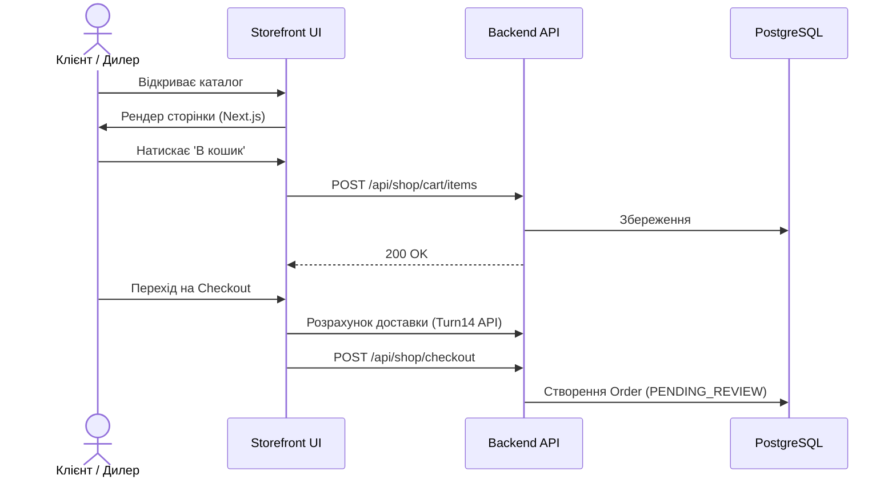

# 🛍 Phase C — Storefront + Cart + Checkout

> [!success] Статус: **100%** — Всі платіжні методи інтегровано (FOP, Stripe, WhitePay Crypto, WhitePay Fiat)

---

## 🎨 Storefront Visuals (UI / UX)

Цей розділ повністю відповідає концепції **Stealth Wealth**. Ми використовуємо преміальні темні тони, висококонтрастні акценти та фокус на самому продукті.

> [!example] Дизайн Магазину та Чекаут
> ![[screenshots/storefront_hero.png]]
> ![[screenshots/storefront_checkout.png]]
> ![[screenshots/storefront_profile.png]]

---

## Що Реалізовано

### 🛒 User Journey (Шлях клієнта)

### 📄 Сторінки Storefront
- **`/shop`** — Головна магазину (portal з брендами)
- **`/shop/[collection]`** — Колекція (Burger, DO88, etc)
- **`/shop/[collection]/[slug]`** — Сторінка товару
- **`/shop/cart`** — Кошик
- **`/shop/checkout`** — Оформлення замовлення
- **`/shop/profile`** — Особистий кабінет (B2B/B2C Tier status, tracking)
- **`/shop/order/[token]`** — Підтвердження замовлення

### 🛍 Кошик
- **Guest cart:** зберігається в cookie/session (edge-friendly)
- **Customer cart:** зберігається в БД (persistent)
- Злиття кошиків при логіні
- Add / Update / Remove items

### Checkout Flow
1. Контактні дані (email, телефон, ім'я)
2. Адреса доставки
3. Спосіб доставки (per shipping zone)
4. Tax розрахунок по регіону
5. Підтвердження замовлення
6. **→ Order зі статусом `PENDING_REVIEW`**

### Notifications
- ✅ Email підтвердження клієнту (Resend)
- ✅ Notification в адмінку

---

## ✅ Оплата — Інтегровано

> [!success] Платіжні методи
> - **FOP** — оплата за реквізитами (IBAN), гібридний чекаут
> - **Stripe** — міжнародні картки (EUR/USD)
> - **WhitePay Crypto** — USDT, BTC, ETH з авто-редиректом
> - **WhitePay Fiat** — Apple Pay / Google Pay через WhitePay gateway

---

## API Routes

| Route | Метод | Призначення |
|---|---|---|
| `/api/shop/products` | GET | Список товарів |
| `/api/shop/products/[slug]` | GET | Деталі товару |
| `/api/shop/categories` | GET | Категорії |
| `/api/shop/cart/items` | POST | Додати в кошик |
| `/api/shop/cart/items/[id]` | PATCH/DEL | Оновити/видалити |
| `/api/shop/checkout` | POST | Створити замовлення |
| `/api/shop/orders/[num]` | GET | Перегляд по токену |

---

## Зв'язки

- Товари з → [[Phase B — Catalog]]
- Ціни через → [[Pricing]]
- Доставка через → [[Logistics]]
- Замовлення обробляються в → [[Phase D — Orders]]

← [[Home]]
