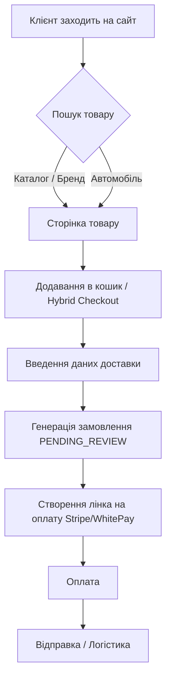

# 🏪 Shop Overview

> [!success] Архітектура e-commerce One Company SHOP
> Прогрес: **97%** · Всі основні фази завершено

Це зведена нотатка по всій e-commerce частині.

## User Journey (Шлях клієнта)

## Фази розробки (Прогрес)
- **Phase A**: Security & Auth (`100%`)
- **Phase B**: Catalog & Brands (`100%`)
- **Phase C**: Storefront Design (`100%`)
- **Phase D**: Orders & CRM (`95%`)
- **Phase E**: CSV Import (`100%`)
- **Phase F**: SEO & Google (`90%`)

Детальніше: [[Phase A — Security]] · [[Phase B — Catalog]] · [[Phase C — Storefront]] · [[Phase D — Orders]] · [[Phase E — CSV Import]] · [[Phase F — SEO]]

---

## Стек та Інфраструктура

`Next.js 14` → `Prisma ORM` → `PostgreSQL (Supabase)` → `Vercel`

## Ключові Фічі

- ✅ Multi-brand catalog (6+ брендів)
- ✅ Multi-currency (UAH/EUR/USD)
- ✅ Multi-warehouse logistics (US/EU/UA)
- ✅ B2B + B2C pricing
- ✅ Guest + Customer checkout
- ✅ Turn14 API integration (~700K products)
- ✅ Admin panel (RBAC)
- ✅ Payment gateway (Stripe + WhitePay)
- ✅ CSV Import wizard

## Shopify Storefronts
Окрім основного порталу `onecompany.global`, ми маємо спеціалізовані окремі брендові магазини на базі Shopify для покращеної конверсії:
- **Eventuri** (`eventuri.onecompany.global`) — мультимовний магазин кастомного UI.
- **KW Automotive** (`kw.onecompany.global`) — підвіски.
Більше інформації: [[Shopify Storefronts]]

## Зв'язки

- Canvas → [[Shop Mind Map]]
- Маркетинг → [[Marketing Strategy]]
- Бренди → [[Brands]]

← [[Home]]
